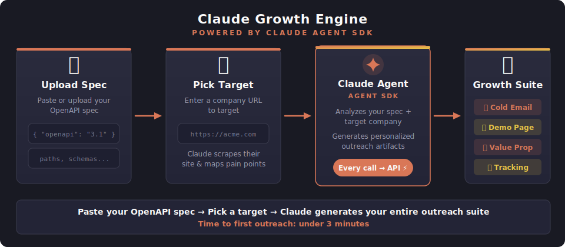

<div align="center">


# Claude Growth Engine

**Close prospects faster with an agentic growth engine you can set up in under 3 minutes**


<br />

[](https://nextjs.org)
[](https://typescriptlang.org)
[](https://platform.claude.com/docs/en/agent-sdk/overview)
[](LICENSE)

<br />



<br />

## Watch the 7-Minute Walkthrough

[](https://youtu.be/XZWcyL6qQwM)

</div>

---

## What It Does

Paste your OpenAPI spec. Pick a target company. Claude does the rest.

1. **Parses your API** — validates with swagger-parser, extracts every endpoint and its capabilities
2. **Researches the target** — agent browses their site, finds their logo, reads their pain points, maps their tech stack
3. **Generates a complete outreach suite:**
   - 📧 **Cold email** — under 4 lines, mapped to their specific pain points
   - 🎯 **Branded demo page** — their logo, their name, "make your first API call in under a minute"
   - 📊 **Value proposition** — which of your endpoints solve which of their problems
   - 💼 **LinkedIn message** — short, specific, referencing something real about their company
4. **Scores and ranks leads** — tracks demo page engagement and surfaces the hottest prospects
5. **Tells you when to follow up** — engagement signals drive re-engagement timing

Every action flows through the **Claude Agent SDK** → **Anthropic API**. Tracking writes to Google Sheets via MCP. No database needed.

---

## Lead Scoring

Not all prospects are equal. Growth Engine automatically ranks leads based on real engagement:

| Signal | Weight | Meaning |
|--------|--------|---------|
| Demo page opened | Low | Curiosity |
| Time on page > 2 min | Medium | Interest |
| API playground interaction | High | Intent |
| Feedback survey submitted | Very High | Engaged |
| Multiple visits | Very High | Evaluating |

Your Google Sheet auto-sorts by engagement score. Hottest leads float to the top:

- 🔥 **Hot** (>80): Follow up today
- 🟡 **Warm** (40-80): Send case study in 2 days
- ❄️ **Cold** (<40): Re-engage in a week

---

## Quick Start

```bash
git clone https://github.com/zackproser/claude-growth-engine.git
cd claude-growth-engine
pnpm install
echo 'ANTHROPIC_API_KEY=your-key' > .env.local
pnpm dev
```

Open [localhost:3000](http://localhost:3000). There's a sample API spec in `examples/sample-spec.json` to test with.

---

## How It Works Under the Hood

The Claude Agent SDK gives the agent real tools — web search, web fetch, and MCP server connections. One `query()` call does everything:

```typescript
import { query } from "@anthropic-ai/claude-agent-sdk";

for await (const message of query({
  prompt: `Research ${targetUrl}, find their pain points,
           generate outreach artifacts, log to tracking sheet`,
  options: {
    mcpServers: {
      "google-sheets": {
        command: "npx",
        args: ["-y", "google-sheets-mcp"]
      }
    },
    allowedTools: [
      "WebSearch", "WebFetch", "Bash",
      "mcp__google-sheets__*"
    ]
  }
})) {
  console.log(message);
}
```


---

## Tech Stack

| Layer | Technology |
|-------|-----------|
| **Frontend** | Next.js 16, TypeScript, Tailwind CSS |
| **AI Agent** | Claude Agent SDK + MCP |
| **Spec Validation** | swagger-parser |
| **Sheets Tracking** | google-sheets-mcp |
| **Email** | Resend |

---

## License

MIT — see [LICENSE](LICENSE) for details.

---

<div align="center">

**Built by [Zack Proser](https://zackproser.com)**

*Close prospects faster. Powered by Claude.*

</div>
